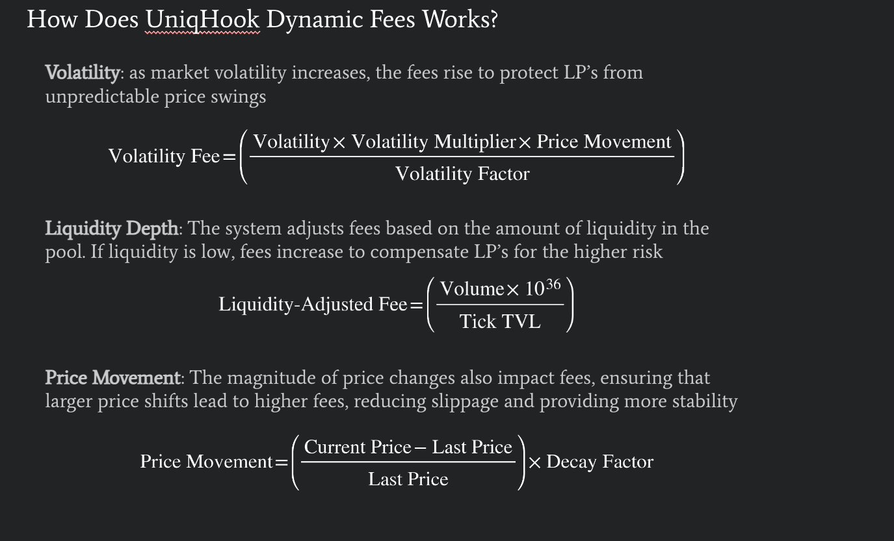

# RWA Assets with Volatility-Based Dynamic Fees

This repository contains two core components: **UniqRWA** and **UniqHook**, which collectively enable the tokenization of real-world assets (RWA) and provide dynamic fee optimization for liquidity pools on Uniswap v4. The contracts offer unique features that bridge the gap between traditional finance and decentralized finance (DeFi), optimizing liquidity and trading fees in volatile markets.

## Table of Contents

- [RWA Assets with Volatility-Based Dynamic Fees](#rwa-assets-with-volatility-based-dynamic-fees)
  - [Table of Contents](#table-of-contents)
  - [Overview](#overview)
  - [UniqRWA](#uniqrwa)
    - [Features](#features)
    - [Functions](#functions)
    - [How It Works](#how-it-works)
    - [Usage](#usage)
  - [UniqHook](#uniqhook)
    - [Features](#features-1)
    - [Dynamic Fee Calculation](#dynamic-fee-calculation)
    - [TWAMM Integration](#twamm-integration)
    - [Usage](#usage-1)
  - [Installation](#installation)
  - [Foundry](#foundry)
  - [Documentation](#documentation)
  - [Usage](#usage-2)
    - [Build](#build)
    - [Test](#test)
    - [Format](#format)
    - [Gas Snapshots](#gas-snapshots)
    - [Anvil](#anvil)
    - [Deploy](#deploy)
    - [Cast](#cast)
    - [Help](#help)

---

## Overview

**UniqRWA** enables the tokenization of real-world assets (such as stocks, bonds, etc.) using Chainlink Functions and APIs to interact with external financial data sources (e.g., Alpaca Markets). The minted RWA tokens can be used as liquidity on Uniswap, further unlocking liquidity in decentralized finance.

**UniqHook** complements this by managing dynamic fees in the liquidity pool. It adjusts fees based on volatility, liquidity depth, and trade size to protect liquidity providers and reduce slippage. The integration with Brevis Contract validates market volatility, enhancing the dynamic fee calculation.

---

## UniqRWA

### Features

- **RWA Tokenization**: Mints RWA-backed tokens by interacting with external APIs via Chainlink Functions.
- **Collateral Management**: Ensures that sufficient collateral exists for minting new tokens.
- **Redemption Mechanism**: Allows users to redeem RWA tokens in exchange for stablecoins.
- **Chainlink Oracles**: Ensures accurate price feeds for RWA and USDC tokens.

### Functions

- `sendMintRequest`: Sends a request to mint RWA tokens.
- `sendRedeemRequest`: Initiates the process to redeem RWA tokens.
- `withdraw`: Allows users to withdraw their redeemed stablecoins.
- `getAssetPrice`: Fetches the current price of an RWA asset via Chainlink price feed.
- `getCalculatedNewTotalValue`: Calculates the updated portfolio value after new tokens are minted.

### How It Works

1. The user initiates a **mint request** to create RWA tokens, calling Chainlink Functions to fetch price data from an external API (e.g., Alpaca Markets).
2. Upon fulfillment, the requested number of tokens is minted and sent to the user's wallet.
3. The user can add these tokens to Uniswap liquidity pools via UniqHook.
4. **Redemption**: Users can redeem their RWA tokens back into stablecoins (USDC) by sending a redemption request, which is fulfilled through Chainlink.

### Usage

1. Call `sendMintRequest` to mint new RWA tokens.
2. Use these tokens in liquidity pools or hold them for long-term exposure.
3. Call `sendRedeemRequest` to convert the tokens back into stablecoins when desired.
4. Withdraw the stablecoins using the `withdraw` function.

---

## UniqHook

### Features

- **Dynamic Fees**: Adjusts fees based on market volatility, liquidity depth, and trade size.
- **Protection for Liquidity Providers**: Dynamic fee adjustment protects LPs from large trades and market volatility.
- **TWAMM Integration**: Supports **Time-Weighted Automated Market Maker** (TWAMM) for executing large orders over time.
- **Volatility Smoothing**: Uses Brevis Contract to validate market volatility and adjust fees accordingly.

### Dynamic Fee Calculation

UniqHook calculates fees dynamically based on several factors:

- **Price Movement**: Determines how much the price has moved between trades.
- **Volatility**: High volatility results in higher fees to protect liquidity providers.
- **Liquidity Depth**: The deeper the liquidity, the smaller the fee impact.
- **Volume**: The larger the volume of the trade, the higher the potential fee.
- **Directional Multiplier**: Increases fees for aggressive trades to dissuade market manipulation.

Formula for Dynamic Fee:


### TWAMM Integration

- **Large Orders**: UniqHook supports Time-Weighted Automated Market Making (TWAMM), which allows users to split large trades into smaller, more manageable pieces.
- **Reduced Slippage**: TWAMM ensures that large trades are executed over time, reducing slippage and market impact.

### Usage

1. Add liquidity using RWA tokens and stablecoins through UniqHook.
2. Monitor market conditions; UniqHook will dynamically adjust fees based on real-time volatility and liquidity.
3. Execute large orders using TWAMM to reduce slippage and protect against price fluctuations.

---

## Installation

To deploy and test the contracts locally, follow these steps:

1. **Clone the repository**:
   ```bash
   git clone https://github.com/your-repo/Uniq.git
   cd Uniq
   ```

## Foundry

**Foundry is a blazing fast, portable and modular toolkit for Ethereum application development written in Rust.**

Foundry consists of:

- **Forge**: Ethereum testing framework (like Truffle, Hardhat and DappTools).
- **Cast**: Swiss army knife for interacting with EVM smart contracts, sending transactions and getting chain data.
- **Anvil**: Local Ethereum node, akin to Ganache, Hardhat Network.
- **Chisel**: Fast, utilitarian, and verbose solidity REPL.

## Documentation

https://book.getfoundry.sh/

## Usage

### Build

```shell
$ forge build
```

### Test

```shell
$ forge test
```

### Format

```shell
$ forge fmt
```

### Gas Snapshots

```shell
$ forge snapshot
```

### Anvil

```shell
$ anvil
```

### Deploy

```shell
$ forge script script/Counter.s.sol:CounterScript --rpc-url <your_rpc_url> --private-key <your_private_key>
```

### Cast

```shell
$ cast <subcommand>
```

### Help

```shell
$ forge --help
$ anvil --help
$ cast --help
```
